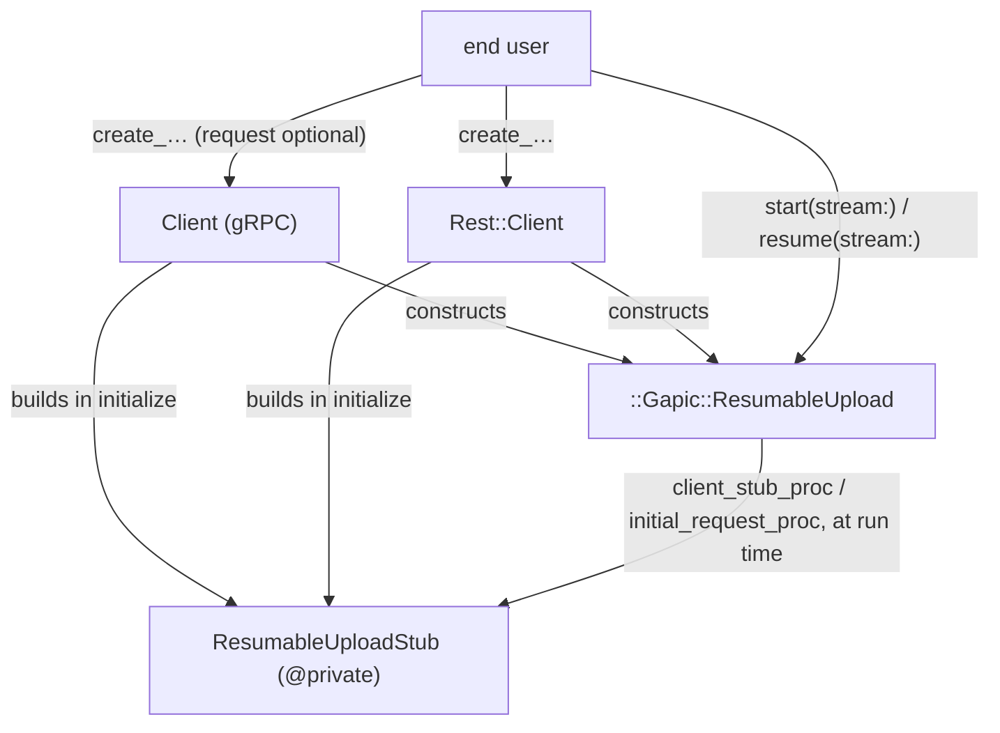

# Resumable upload generation in gapic-generator-ruby

The generator half. The runtime handle it produces is described in [resumable-upload-gapic-common.md](resumable-upload-gapic-common.md).

## 1. What the user gets

```ruby
client = ::Google::Ads::GoogleAds::V24::Services::YouTubeVideoUploadService::Client.new

upload = client.create_you_tube_video_upload request          # no I/O, no transcoding yet
response = upload.start stream: io, content_type: "video/mp4", chunk_size: 8 * 1024 * 1024

response = upload.resume stream: File.open(path, "rb")        # reuses last run's URL and chunk size

upload = client.create_you_tube_video_upload                  # no request needed to resume
response = upload.resume stream: io, upload_url: saved_url, chunk_size: saved_chunk_size
```

The same method exists, with the same name and signature, on both the gRPC and the REST client. The upload itself always travels over REST.

## 2. Generated artifacts



| File | Contents |
|---|---|
| `lib/.../foo/resumable_upload_stub.rb` | `Foo::ResumableUploadStub`, `@private` |
| `lib/.../foo.rb`, `lib/.../foo/rest.rb` | `require` for the above |
| `lib/.../foo/client.rb`, `lib/.../foo/rest/client.rb` | stub built in `initialize`; one upload method per upload RPC |
| `test/.../foo_resumable_upload_test.rb` | generated unit tests |
| `snippets/foo/create_you_tube_video_upload.rb` | snippet |

One stub class, shared by both surfaces, deliberately not nested under `Rest::`. There is no second proto service to wrap here, so an `Operations`-style client class would be an empty shell; and a gRPC client reaching into its own `Rest::` namespace would be worse than a neutral one.

## 3. `ResumableUploadStub`

Owns three things and nothing else: the REST client stub, the transcoders, and the deferred credentials error.

```ruby
class ResumableUploadStub
  # @private
  CREATE_YOU_TUBE_VIDEO_UPLOAD_URL_PREFIX = "resumable/upload"

  # @private
  def initialize endpoint:, endpoint_template:, universe_domain:, credentials:, logger:
    require "gapic/rest"

    if defined?(::GRPC::Core::Channel) &&
       (credentials.is_a?(::GRPC::Core::Channel) || credentials.is_a?(::GRPC::Core::ChannelCredentials))
      @credentials_error = ::ArgumentError.new(
        "Resumable uploads are performed over REST and cannot use a gRPC channel as credentials, " \
        "because credentials cannot be recovered from a channel. Construct the client with Google " \
        "OAuth credentials (a keyfile path, a Hash, or a Google::Auth::Credentials instance) to use " \
        "resumable upload methods."
      )
      return
    end

    @client_stub = ::Gapic::Rest::ClientStub.new endpoint: endpoint, endpoint_template: endpoint_template,
                                                 universe_domain: universe_domain, credentials: credentials,
                                                 numeric_enums: false, service_name: self.class,
                                                 raise_faraday_errors: false, logger: logger
  end

  # @private
  def client_stub
    raise @credentials_error if @credentials_error
    @client_stub
  end

  # @private
  def transcode_create_you_tube_video_upload_request request_pb
    transcoder = ::Gapic::Rest::GrpcTranscoder.new
                                              .with_bindings(
                                                uri_method: :post,
                                                uri_template: "/v24/customers/{customer_id}/youTubeVideoUploads:create",
                                                body: "*",
                                                matches: [["customer_id", %r{^[^/]+/?$}, false]]
                                              )
    _verb, uri, query_string_params, body = transcoder.transcode request_pb
    [self.class.upload_uri(CREATE_YOU_TUBE_VIDEO_UPLOAD_URL_PREFIX, uri, query_string_params), body]
  end

  # @private
  def self.upload_uri prefix, uri, query_string_params
    uri = "/#{prefix}#{uri}"
    query_string_params.any? ? "#{uri}?#{query_string_params.join '&'}" : uri
  end
end
```

Notes:

* **Built eagerly** in both clients' `initialize`, in the same place and style as the LRO `@operations_client`. No lazy accessor; no gapic-common modules mixed into the client itself.
* **`numeric_enums: false`** — nothing on this path decodes enums out of a query-form response.
* `raise_faraday_errors: false`, `service_name:` and `logger:` match the ordinary REST service stub. (The LRO `OperationsServiceStub` passes none of those four; that inconsistency is not replicated here.)
* The transcoder emission is exactly what `grpc_transcoding_method/_def.text.erb` produces today. The verb is discarded — initiation is always `POST`, enforced at generation time — and the helper folds the prefix and the query string into the returned URL, because the driver sends initiation with `params: {}`.
* Endpoint handling is inherited: `ClientStub` prepends `https://` to a bare host. A user-set `config.endpoint = "localhost:7469"` behaves exactly as it does for any REST client today.

## 4. The generated method

```ruby
def create_you_tube_video_upload request = {}, options = nil
  raise ::ArgumentError, "request must be provided" if request.nil?
  request = ::Gapic::Protobuf.coerce request, to: ::Google::Ads::…::CreateYouTubeVideoUploadRequest
  options = ::Gapic::CallOptions.new(**options.to_h) if options.respond_to? :to_h

  metadata = @config.rpcs.create_you_tube_video_upload.metadata.to_h
  metadata[:"x-goog-api-client"] ||= ::Gapic::Headers.x_goog_api_client \
    lib_name: @config.lib_name, lib_version: @config.lib_version,
    gapic_version: ::Google::Ads::…::VERSION,
    transports_version_send: [:rest]
  metadata[:"x-goog-api-version"] = API_VERSION unless API_VERSION.empty?
  metadata[:"x-goog-user-project"] = @quota_project_id if @quota_project_id
  # routing params partial unchanged

  options.apply_defaults timeout:      @config.rpcs.create_you_tube_video_upload.timeout,
                         metadata:     metadata,
                         retry_policy: @config.rpcs.create_you_tube_video_upload.retry_policy
  options.apply_defaults timeout: @config.timeout, metadata: @config.metadata, retry_policy: @config.retry_policy

  ::Gapic::ResumableUpload.new(
    client_stub_proc:     -> { @resumable_upload_stub.client_stub },
    initial_request_proc: -> { @resumable_upload_stub.transcode_create_you_tube_video_upload_request request },
    initial_headers:      options.metadata,
    start_retry_policy:   ::Gapic::Rest::ResumableUpload.start_retry_policy_for(options),
    response_type:        ::Google::Ads::…::CreateYouTubeVideoUploadResponse,
    error_handler:        ->(e) { ::Google::Cloud::Error.from_error e }
  )
end
```

* **`request = {}`.** The ordinary request checks still run immediately — an explicit `nil` is an error, a Hash is coerced — but nothing is transcoded. Resuming needs no request, so the argument has a default and the coerced empty message is simply never used.
* **Lazy transcoding.** The method hands over two procs rather than a URL and a body. Transcoding happens inside `#start`, never on the resume path.
* **`transports_version_send: [:rest]`** even on the gRPC surface: the request this header describes is a REST request.
* **The method builds the handle**, not the stub. Metadata assembly, the retry-policy conversion and the error handler stay visible in the client, where a reader expects to find them.
* The error handler comes from a new, flavor-overridable partial. It must *return* the wrapped error rather than raise it; the existing `_rescue` partial emits a raising `rescue` clause and cannot be reused. The default flavor emits nothing; cloud emits `::Google::Cloud::Error.from_error`.
* Documentation: the request parameter gains "optional; ignored when resuming", the return value documents the handle, and the options docs state that headers, retry policy and timeout apply to the initiation request only.

## 5. Credentials

| `config.credentials` | `Client.new` | upload method call | `#start` / `#resume` |
|---|---|---|---|
| String / Hash / `Google::Auth::Credentials` / `Signet` / Proc | ok | ok | ok |
| `Symbol` (e.g. `:this_channel_is_insecure`) | ok | ok | ok — the REST client stub skips its authorization middleware for Symbols |
| `GRPC::Core::Channel`, `GRPC::Core::ChannelCredentials` | ok | ok, returns a handle | raises the stored `ArgumentError`, before any stream I/O |

Adding an upload RPC to an existing service therefore cannot break an existing caller: construction never raises, never warns, and every non-upload method keeps working. The `defined?(::GRPC::Core::Channel)` guard keeps the check safe in REST-only gems where gRPC is never loaded.

## 6. Detection and URL prefixes

One model class, `Gapic::Model::Method::ResumableUpload`, built in `MethodPresenter#initialize` beside `@lro` and surfaced as `MethodPresenter#resumable_upload?` / `#upload_url_prefix`. Until the upload annotation is published, it carries the table.

Two match kinds, because the Google Ads protos are versioned and republished constantly while showcase is a single fixed name:

```ruby
# Exact full-name matches.
EXACT_PREFIXES = {
  "google.showcase.v1beta1.ResumableUploadService.UploadMedia" => "resumable/upload"
}.freeze

# Version-family matches: anchored on the left at the package, on the right at service + method,
# with the intervening segments (e.g. ".services.") unconstrained.
VERSIONED_PREFIXES = [
  {
    left:   /\Agoogle\.ads\.googleads\.v[0-9_]+\./, # must match v23, v23_1 etc
    right:  ".YouTubeVideoUploadService.CreateYouTubeVideoUpload",
    prefix: "resumable/upload"
  }
].freeze

def self.url_prefix_for full_name
  EXACT_PREFIXES[full_name] ||
    VERSIONED_PREFIXES.find { |m| m[:left].match?(full_name) && full_name.end_with?(m[:right]) }&.fetch(:prefix)
end
```

This covers `google.ads.googleads.v<anything>.services.YouTubeVideoUploadService.CreateYouTubeVideoUpload` for every version Ads publishes, without enumerating them. The prefix is per-RPC, so a hypothetical service with two upload RPCs on different prefixes is expressible; in practice the generated stub emits one constant per upload RPC.

When the annotation lands, `url_prefix_for` keeps the table and detection moves to `http.media_upload.enabled` — `google.api.http` is already registered in `Schema::Method::OPTION_EXTENSION_NAMES`, so that is a small, isolated change.

**Generation-time validation** (`Gapic::Model::ModelError`): a matched RPC must be unary — not client- or server-streaming, not paginated, not long-running — and its first HTTP binding must be `post` with a body. Anything else is a misconfiguration and must fail the build rather than generate something that cannot work.

## 7. Change list

| File | Change |
|---|---|
| `lib/gapic/model/method/resumable_upload.rb` | new: match tables, prefix lookup, validation |
| `lib/gapic/presenters/method_presenter.rb` | build the model; `#resumable_upload?`, `#upload_url_prefix` |
| `lib/gapic/presenters/service_presenter.rb`, `service_rest_presenter.rb` | `#resumable_upload?`, stub name / file path / require helpers |
| `lib/gapic/generators/default_generator.rb` | emit the stub file when the service has upload RPCs |
| `gapic-generator-ads/lib/gapic/generators/ads_generator.rb` | the same emission line — the ads generator re-implements its own file list |
| `templates/default/service/resumable_upload_stub.text.erb` + partial | new |
| `templates/default/lib/_service.text.erb`, `lib/rest/_rest.text.erb` | require the stub |
| `templates/default/service/{,rest/}client/_client.text.erb` | build the stub in `initialize` |
| `templates/default/service/{,rest/}client/method/_def.text.erb` | `request = {}` for upload methods |
| `templates/default/service/{,rest/}client/method/def/_response_resumable_upload.text.erb` | new dispatch arm |
| `templates/default/service/{,rest/}client/method/def/_upload_error_handler.text.erb` | new, overridden by the cloud flavor |
| `templates/default/service/{,rest/}client/method/docs/*` | request-optional and initiation-scope wording |
| test and snippet templates | new |

## 8. Testing

* **Showcase fixtures.** `shared/protos/google/showcase` is a symlink into the `shared/gapic-showcase` submodule (pinned at `b6c247f`), so: bump the submodule to a release containing the upload service, add the proto to the showcase entry in `shared/gem_defaults.rb`, then `cd shared && toys bin showcase && toys gen showcase`.
* **Goldens.** Regenerated showcase and googleads output committed alongside the generator change; verified by `toys test` in `gapic-generator` and `gapic-generator-ads`.
* **Model and presenter unit tests.** Exact and versioned matching (including several `v<N>` values and a near-miss that must not match), prefix lookup, and each validation failure: streaming, paginated, long-running, non-POST binding, missing body.
* **Generated unit tests**, both transports, no network: the method returns a handle; the handle carries the expected initiation URL (prefix and query folding included), response type and initiation retry policy; a client built with channel credentials still returns a handle, and that handle raises on `start` without reading the stream.
* **Functional showcase tests** (`shared/test/showcase`), both transports: a multi-chunk upload end to end, the channel-credentials failure at `start`, and a start-fail-then-resume cycle. Modelled on the gapic-common acceptance tests rather than its full integration suite.
* **Snippets** for upload RPCs, opening a file for the stream.

## 9. Delivery

A single change: ads and showcase, both transports, generated unit tests, functional tests, snippets, goldens. The only deferred item is annotation-based detection replacing the match tables.
