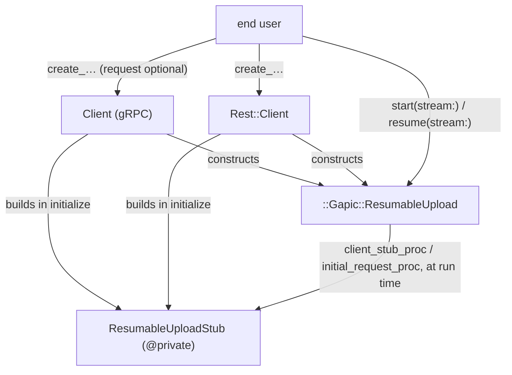

# Resumable upload generation in gapic-generator-ruby

The generator half. The runtime handle it produces is described in [resumable-upload-2-gapic-common.md](resumable-upload-2-gapic-common.md).

## 1. What the user gets

```ruby
client = ::Google::Ads::GoogleAds::V24::Services::YouTubeVideoUploadService::Client.new

upload = client.create_you_tube_video_upload request          # no I/O, no transcoding yet
response = upload.start stream: io, content_type: "video/mp4",
                        chunk_size: 8 * 1024 * 1024,
                        upload_timeout: 4 * 3600              # the whole upload; `options[:timeout]`
                                                              # above would only bound initiation

response = upload.resume stream: File.open(path, "rb")        # reuses the last run's resume handle

upload = client.create_you_tube_video_upload                  # no request needed to resume
response = upload.resume stream: io,
                         resume_handle: ::Gapic::Rest::ResumableUpload::ResumeHandle.new(
                           upload_url: saved_url, chunk_size: saved_chunk_size
                         )
```

The same method exists, with the same name and signature, on both the gRPC and the REST client. The upload itself always travels over REST.

## 2. Generated artifacts



| File | Contents |
|---|---|
| `lib/.../foo/resumable_upload_stub.rb` | `Foo::ResumableUploadStub`, `@private` |
| `lib/.../foo.rb`, `lib/.../foo/rest.rb` | `require` for the above |
| `lib/.../foo/client.rb`, `lib/.../foo/rest/client.rb` | stub built in `initialize`; one upload method per upload RPC |
| `test/.../foo_resumable_upload_test.rb` | generated unit tests |
| `snippets/foo/create_you_tube_video_upload.rb` | snippet |

One stub class, shared by both surfaces, deliberately not nested under `Rest::`. There is no second proto service to wrap here, so an `Operations`-style client class would be an empty shell; and a gRPC client reaching into its own `Rest::` namespace would be worse than a neutral one.

## 3. `ResumableUploadStub`

Owns three things and nothing else: the REST client stub, the transcoders, and the deferred credentials error.

```ruby
class ResumableUploadStub
  # @private
  CREATE_YOU_TUBE_VIDEO_UPLOAD_URL_PREFIX = "resumable/upload"

  # @private
  def initialize endpoint:, endpoint_template:, universe_domain:, credentials:, logger:
    require "gapic/rest"

    if defined?(::GRPC::Core::Channel) &&
       (credentials.is_a?(::GRPC::Core::Channel) || credentials.is_a?(::GRPC::Core::ChannelCredentials))
      @credentials_error = ::ArgumentError.new(
        "Resumable uploads are performed over REST and cannot use a gRPC channel as credentials, " \
        "because credentials cannot be recovered from a channel. Construct the client with Google " \
        "OAuth credentials (a keyfile path, a Hash, or a Google::Auth::Credentials instance) to use " \
        "resumable upload methods."
      )
      return
    end

    @client_stub = ::Gapic::Rest::ClientStub.new endpoint: endpoint, endpoint_template: endpoint_template,
                                                 universe_domain: universe_domain, credentials: credentials,
                                                 numeric_enums: false, service_name: self.class,
                                                 raise_faraday_errors: false, logger: logger
  end

  # @private
  def client_stub
    raise @credentials_error if @credentials_error
    @client_stub
  end

  # @private
  def self.transcode_create_you_tube_video_upload_request request_pb
    transcoder = ::Gapic::Rest::GrpcTranscoder.new
                                              .with_bindings(
                                                uri_method: :post,
                                                uri_template: "/v24/customers/{customer_id}/youTubeVideoUploads:create",
                                                body: "*",
                                                matches: [["customer_id", %r{^[^/]+/?$}, false]]
                                              )
    _verb, uri, query_string_params, body = transcoder.transcode request_pb
    uri = "/#{CREATE_YOU_TUBE_VIDEO_UPLOAD_URL_PREFIX}#{uri}"
    uri = "#{uri}?#{query_string_params.join '&'}" if query_string_params.any?
    [uri, body]
  end
end
```

Notes:

* **Built eagerly** in both clients' `initialize`, in the same place and style as the LRO `@operations_client`. No lazy accessor; no gapic-common modules mixed into the client itself.
* **No public reader.** The client keeps the stub in `@resumable_upload_stub` and exposes no `attr_reader` for it — this is where the resemblance to LRO stops. `operations_client` is public because it is a real, documented sub-client a user is expected to call; `ResumableUploadStub` is `@private` plumbing whose only methods are a credentials-guarded stub accessor and a transcoder. Publishing it would invite callers to depend on a class that exists to be reshaped when the upload annotation lands.
* **The transcoder is a class method.** It is pure — request message in, `[url, body]` out — so it needs neither the client stub nor the credentials check, and a unit test can call it with no client at all. This also matches the existing REST service stub, whose `transcode_*_request` methods are class methods too.
* **The transcoding partial cannot be reused as-is.** `grpc_transcoding_method/_def.text.erb` emits a method whose body ends in `transcoder.transcode request_pb`, i.e. the four-tuple `[verb, uri, query_string_params, body]`. What this stub needs is a two-element `[url, body]` with the prefix prepended and the query string folded in, because the driver sends initiation with `params: {}`. The verb is discarded outright — initiation is always `POST`, enforced at generation time. So: extract the `.with_bindings(…)` chain from `_def.text.erb` into a small shared sub-partial, have the existing partial render it, and add a second wrapper partial for the upload stub that renders the same chain and then folds the result. Binding emission keeps one source of truth; only the tail differs.
* **`numeric_enums: false`** — nothing on this path decodes enums out of a query-form response.
* `raise_faraday_errors: false`, `service_name:` and `logger:` match the ordinary REST service stub. (The LRO `OperationsServiceStub` passes none of those four; that inconsistency is not replicated here.)
* Endpoint handling is inherited: `ClientStub` prepends `https://` to a bare host. A user-set `config.endpoint = "localhost:7469"` behaves exactly as it does for any REST client today.

### 3.1 What the REST service stub must *not* emit

An upload RPC has no ordinary REST path. The REST client's upload method delegates to the handle exactly as the gRPC one does, so the plain `call_create_you_tube_video_upload` method on `Rest::ServiceStub`, and the plain transcoder next to it, would be dead code that also happens to be wrong — a non-resumable POST of the whole payload.

The obstacle is that `ServiceRestPresenter#methods` is a single list driving three loops: the two in `service/rest/service_stub/_service_stub.text.erb` (method definitions, then transcoders) and the method loop in `rest/client/_client.text.erb`. Flipping `MethodPresenter#can_generate_rest?` to `false` for upload RPCs would silence all three and delete the REST client method as well.

So the list forks rather than shrinks:

| List | Content | Consumers |
|---|---|---|
| `ServiceRestPresenter#methods` | unchanged | REST client method loop, docs, snippets |
| `ServiceRestPresenter#service_stub_methods` | `methods.reject(&:resumable_upload?)` | both loops in `_service_stub.text.erb` |

The standard generated client tests take the same exclusion — `service/test/client.text.erb` iterates `service.methods` and its REST counterpart `service.rest.methods`; both skip upload RPCs, which get their own generated test file instead (§7, §8). Nothing else consumes either list.

## 4. The generated method

```ruby
def create_you_tube_video_upload request = {}, options = nil
  raise ::ArgumentError, "request must be provided" if request.nil?
  request = ::Gapic::Protobuf.coerce request, to: ::Google::Ads::…::CreateYouTubeVideoUploadRequest
  options = ::Gapic::CallOptions.new(**options.to_h) if options.respond_to? :to_h

  metadata = @config.rpcs.create_you_tube_video_upload.metadata.to_h
  metadata[:"x-goog-api-client"] ||= ::Gapic::Headers.x_goog_api_client \
    lib_name: @config.lib_name, lib_version: @config.lib_version,
    gapic_version: ::Google::Ads::…::VERSION,
    transports_version_send: [:rest]
  metadata[:"x-goog-api-version"] = API_VERSION unless API_VERSION.empty?
  metadata[:"x-goog-user-project"] = @quota_project_id if @quota_project_id
  # routing params partial unchanged

  options.apply_defaults timeout:      @config.rpcs.create_you_tube_video_upload.timeout,
                         metadata:     metadata,
                         retry_policy: @config.rpcs.create_you_tube_video_upload.retry_policy
  options.apply_defaults timeout: @config.timeout, metadata: @config.metadata, retry_policy: @config.retry_policy

  ::Gapic::ResumableUpload.new(
    client_stub_proc:     -> { @resumable_upload_stub.client_stub },
    initial_request_proc: -> { ::Google::Ads::…::ResumableUploadStub.transcode_create_you_tube_video_upload_request request },
    initial_headers:      options.metadata,
    start_retry_policy:   ::Gapic::Rest::ResumableUpload.start_retry_policy_for(options),
    response_type:        ::Google::Ads::…::CreateYouTubeVideoUploadResponse,
    method_name:          "create_you_tube_video_upload",
    error_handler:        nil   # ads and default flavors; the cloud flavor emits a lambda here
  )
end
```

* **`request = {}`.** The ordinary request checks still run immediately — an explicit `nil` is an error, a Hash is coerced — but nothing is transcoded. Resuming needs no request, so the argument has a default and the coerced empty message is simply never used.
* **Lazy transcoding.** The method hands over two procs rather than a URL and a body. Transcoding happens inside `#start`, never on the resume path.
* **`transports_version_send: [:rest]`** even on the gRPC surface: the request this header describes is a REST request.
* **`method_name`** is the same string the client already uses for logging on every other call, so upload log entries name the RPC instead of a bare `ResumableUpload.start`.
* **The method builds the handle**, not the stub. Metadata assembly, the retry-policy conversion and the error handler stay visible in the client, where a reader expects to find them.
* **The error handler** comes from a new, flavor-overridable partial, and it must *return* the wrapped error rather than raise it; the existing `_rescue` partial emits a raising `rescue` clause and cannot be reused. The default and ads flavors emit `nil` — neither wraps errors today — so the sketch above, which is an ads client, passes `nil`. Only the cloud flavor emits a lambda, `->(e) { ::Google::Cloud::Error.from_error e }`, matching what its `_rescue` partial raises for every other method.
* **Documentation** is not a detail here; see §4.1.

### 4.1 What the generated docs must say about `timeout`

An upload method inherits the standard `@param options` block, and that block is actively misleading for it: on every other RPC `timeout` bounds the whole call, and on this one it bounds a single HTTP request that finishes in milliseconds while the operation it starts may run for hours. The same goes for `retry_policy`, which governs only the initiation attempt — the upload's own chunk-level retries are the protocol's, and no call option reaches them.

So upload methods get their own docs partial, overriding the shared one, emitting something close to:

```ruby
# @param options [::Gapic::CallOptions, ::Hash]
#   Overrides for the **initiation request only**. `timeout`, `retry_policy` and
#   `metadata` here apply to the single request that creates the upload session,
#   not to the upload as a whole: an upload that is still transferring bytes an
#   hour later has long outlived this `timeout`.
#
#   To bound the whole upload, pass `upload_timeout:` to
#   {::Gapic::ResumableUpload#start} or {::Gapic::ResumableUpload#resume}.
#   To change how chunk transfers are retried, see the retry policy defaults
#   documented on {::Gapic::ResumableUpload}.
#
# @param request [...] Optional; ignored when resuming, since a resumed upload
#   targets a session the server already created.
#
# @return [::Gapic::ResumableUpload] A reusable handle. No request is sent and
#   no stream is read until you call `#start` or `#resume` on it.
```

The `@example` block changes with it — the snippet for an upload RPC opens a stream and calls `#start`, so a reader sees where the upload arguments actually live rather than inferring that `options` covers them:

```ruby
# @example
#   upload = client.create_you_tube_video_upload request
#   response = upload.start stream: File.open("movie.mp4", "rb"),
#                           content_type: "video/mp4",
#                           upload_timeout: 4 * 3600
```

The same split is restated in three more places, because each has a reader who will not have read the others: the `Rpcs` configuration class documentation, where `create_you_tube_video_upload.timeout` is configured and where "this is the initiation request" is the only thing distinguishing it from its neighbours; the client class overview, in one line; and the generated snippet, as a comment.

## 5. Credentials

| `config.credentials` | `Client.new` | upload method call | `#start` / `#resume` |
|---|---|---|---|
| String / Hash / `Google::Auth::Credentials` / `Signet` / Proc | ok | ok | ok |
| `Symbol` (e.g. `:this_channel_is_insecure`) | ok | ok | ok — the REST client stub skips its authorization middleware for Symbols |
| `GRPC::Core::Channel`, `GRPC::Core::ChannelCredentials` | ok | ok, returns a handle | raises the stored `ArgumentError`, before any stream I/O |

Adding an upload RPC to an existing service therefore cannot break an existing caller: construction never raises, never warns, and every non-upload method keeps working. The `defined?(::GRPC::Core::Channel)` guard keeps the check safe in REST-only gems where gRPC is never loaded.

## 6. Detection and URL prefixes

One model class, `Gapic::Model::Method::ResumableUpload`, built in `MethodPresenter#initialize` beside `@lro` and surfaced as `MethodPresenter#resumable_upload?` / `#upload_url_prefix`. Until the upload annotation is published, it carries the table.

Two match kinds, because the Google Ads protos are versioned and republished constantly while showcase is a single fixed name:

```ruby
# Exact full-name matches.
EXACT_PREFIXES = {
  "google.showcase.v1beta1.ResumableUploadService.UploadMedia" => "resumable/upload"
}.freeze

# Version-family matches: anchored on the left at the package, on the right at service + method,
# with the intervening segments (e.g. ".services.") unconstrained.
VERSIONED_PREFIXES = [
  {
    left:   /\Agoogle\.ads\.googleads\.v[0-9_]+\./, # must match v23, v23_1 etc
    right:  ".YouTubeVideoUploadService.CreateYouTubeVideoUpload",
    prefix: "resumable/upload"
  }
].freeze

def self.url_prefix_for full_name
  EXACT_PREFIXES[full_name] ||
    VERSIONED_PREFIXES.find { |m| m[:left].match?(full_name) && full_name.end_with?(m[:right]) }&.fetch(:prefix)
end
```

This covers `google.ads.googleads.v<anything>.services.YouTubeVideoUploadService.CreateYouTubeVideoUpload` for every version Ads publishes, without enumerating them. The prefix is per-RPC, so a hypothetical service with two upload RPCs on different prefixes is expressible; in practice the generated stub emits one constant per upload RPC.

When the annotation lands, `url_prefix_for` keeps the table and detection moves to `http.media_upload.enabled` — `google.api.http` is already registered in `Schema::Method::OPTION_EXTENSION_NAMES`, so that is a small, isolated change.

**Generation-time validation** (`Gapic::Model::ModelError`): a matched RPC must be unary — not client- or server-streaming, not paginated, not long-running — and its first HTTP binding must be `post` with a body. Anything else is a misconfiguration and must fail the build rather than generate something that cannot work.

## 7. Change list

| File | Change |
|---|---|
| `lib/gapic/model/method/resumable_upload.rb` | new: match tables, prefix lookup, validation |
| `lib/gapic/presenters/method_presenter.rb` | build the model; `#resumable_upload?`, `#upload_url_prefix` |
| `lib/gapic/presenters/service_presenter.rb`, `service_rest_presenter.rb` | `#resumable_upload?`, stub name / file path / require helpers; `ServiceRestPresenter#service_stub_methods` (§3.1) |
| `lib/gapic/presenters/gem_presenter.rb` | raise the generated `gapic-common` dependency floor to the release carrying `::Gapic::ResumableUpload` — rewrites every golden gemspec (§9) |
| `lib/gapic/generators/default_generator.rb` | emit the stub file and the generated upload test file when the service has upload RPCs |
| `gapic-generator-ads/lib/gapic/generators/ads_generator.rb` | the same two emission lines — the ads generator re-implements its own file list and emits no tests at all today, so the test file needs an explicit entry there. Cloud inherits both via `super`. |
| `templates/default/service/resumable_upload_stub.text.erb` + partial | new |
| `templates/default/service/rest/service_stub/grpc_transcoding_method/_bindings.text.erb` | new: the `.with_bindings(…)` chain extracted from `_def.text.erb`, so binding emission has one source of truth |
| `templates/default/service/rest/service_stub/grpc_transcoding_method/_def.text.erb` | render the extracted partial instead of inlining the chain; otherwise unchanged |
| `templates/default/service/rest/service_stub/_service_stub.text.erb` | both per-method loops iterate `service_stub_methods` instead of `methods` |
| `templates/default/lib/_service.text.erb`, `lib/rest/_rest.text.erb` | require the stub |
| `templates/default/service/{,rest/}client/_client.text.erb` | build the stub in `initialize` |
| `templates/default/service/{,rest/}client/method/_def.text.erb` | `request = {}` for upload methods |
| `templates/default/service/{,rest/}client/method/def/_response_resumable_upload.text.erb` | new dispatch arm |
| `templates/default/service/{,rest/}client/method/def/_upload_error_handler.text.erb` | new, overridden by the cloud flavor |
| `templates/default/service/{,rest/}client/method/docs/*` | upload-specific `@param options`, `@param request`, `@return` and `@example` blocks (§4.1): initiation-only scope for `timeout`/`retry_policy`, request-optional, handle return |
| `templates/default/service/{,rest/}client/_config.text.erb` | `Rpcs` configuration docs: one line per upload RPC saying its configured `timeout` and `retry_policy` cover initiation only |
| `templates/default/service/{,rest/}client/_client.text.erb` | client class overview: one line on the same split |
| `templates/default/service/test/client.text.erb`, `service/rest/test/client.text.erb` | skip upload RPCs; they are covered by the new dedicated test file |
| `templates/default/service/test/resumable_upload.text.erb` and snippet templates | new |

## 8. Testing

* **Showcase fixtures.** `shared/protos/google/showcase` is a symlink into the `shared/gapic-showcase` submodule (pinned at `b6c247f`), so: bump the submodule to a release containing the upload service, add the proto to the showcase entry in `shared/gem_defaults.rb`, then `cd shared && toys bin showcase && toys gen showcase`.
* **Goldens.** Regenerated showcase and googleads output committed alongside the generator change; verified by `toys test` in `gapic-generator` and `gapic-generator-ads`.
* **Model and presenter unit tests.** Exact and versioned matching (including several `v<N>` values and a near-miss that must not match), prefix lookup, and each validation failure: streaming, paginated, long-running, non-POST binding, missing body. Plus the two exclusion lists: an upload RPC appears in `ServiceRestPresenter#methods` and not in `#service_stub_methods`.
* **Generated unit tests**, both transports, no network. The handle exposes no initiation URL — it is computed lazily inside `#start` — so the URL is asserted one level down, on the stub: `transcode_…_request` is a stateless class method, and the test calls it directly and asserts the `[url, body]` pair, prefix and folded query string included. What is asserted on the handle is behavioural: the method returns a `::Gapic::ResumableUpload` and performs no HTTP; `#resume_handle` is `nil` and `#resumable?` and `#running?` are `false` before the first run; and a client built with channel credentials still returns a handle, whose `#start` raises `ArgumentError` without reading the stream.
* **Functional showcase tests** (`shared/test/showcase`), both transports: a multi-chunk upload end to end, the channel-credentials failure at `start`, and a start-fail-then-resume cycle. Modelled on the gapic-common acceptance tests rather than its full integration suite.
* **Showcase is HTTP-only**, which the two transports hit differently.
  * REST client: nothing to do. `Gapic::Rest::ClientStub` only prepends `https://` when the endpoint carries no scheme, so `config.endpoint = "http://localhost:7469"` reaches the upload stub intact, exactly as it does for ordinary REST showcase tests today.
  * gRPC client: `config.endpoint` is consumed by the channel as well, and a channel endpoint cannot carry an `http://` scheme. The test therefore substitutes the whole stub around construction — `ResumableUploadStub.stub :new, a_stub_built_with_the_http_endpoint do Client.new … end` — which works precisely because the stub is built eagerly in `initialize` and the client holds nothing else upload-related. Test-only; no production seam, no generated hook.
* **Snippets** for upload RPCs, opening a file for the stream.

## 9. Delivery

Ordering is forced by the gem dependency and runs one way only:

1. `gapic-common` releases `::Gapic::ResumableUpload` as the sole coordinator above `Driver`, deletes `Gapic::Rest::ResumableUpload::Session`, and adds the `method_name` keyword to `Driver`.
2. `GemPresenter#dependencies` raises the generated floor from `"gapic-common" => "~> 1.3"` to that release.
3. The generator change lands with its goldens.

Step 2 rewrites every golden gemspec in the repository, so in practice it travels with step 3 in one PR — but neither can precede step 1, or generated clients would declare a floor that is not on rubygems.

That PR is a single change: ads and showcase, both transports, generated unit tests, functional tests, snippets, goldens. The only deferred item is annotation-based detection replacing the match tables.

