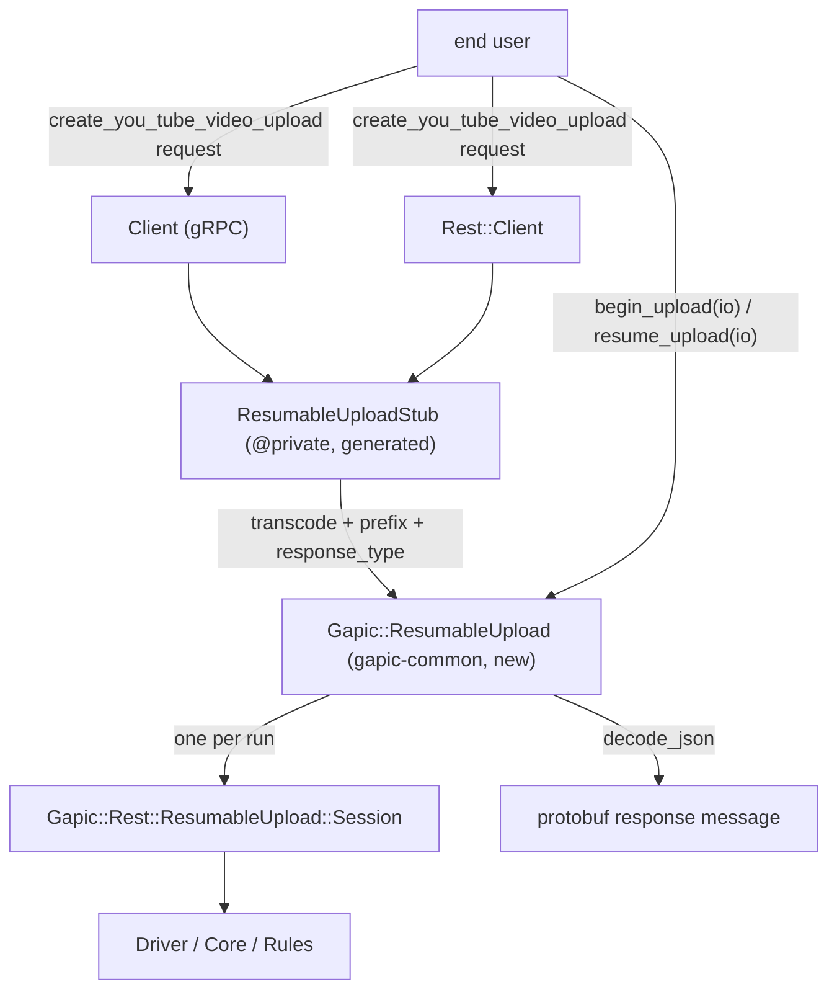

# Resumable Upload in Ruby generated libraries — design proposal

## 0. TL;DR

Three pieces:

1. **gapic-common (new):** `Gapic::ResumableUpload` — a per-method upload handle, the exact analogue of `Gapic::Operation` for LRO. It holds the initiation parameters and the response type, constructs a `Gapic::Rest::ResumableUpload::Session` per run, and decodes the final body into the protobuf response message.
2. **Generated (new file per service):** `<Service>::ResumableUploadStub` — `@private`, structurally a twin of `Rest::ServiceStub`: builds a `Gapic::Rest::ClientStub`, owns the transcoders, prepends the upload URL prefix, returns a `Gapic::ResumableUpload`. This is the Ruby form of the document's "REST-Resumable surface"; **both** the gRPC client and the REST client call into it, so the `must pipe the call` complexity is identical on both sides ().
3. **Generated (changed):** the upload RPC gets a normal-looking generated method on both clients whose only difference from a unary method is that it performs no I/O and returns the handle ().

No network traffic happens until the user calls `#begin_upload` / `#resume_upload`. That is the document's recommended option and it is also forced on us: `Session.new` requires the stream, which the generated method does not have.



## 1. End-user surface

```ruby
client = ::Google::Ads::GoogleAds::V24::Services::YouTubeVideoUploadService::Client.new

upload = client.create_you_tube_video_upload request          # no HTTP yet; returns the handle
upload = client.create_you_tube_video_upload request, options # normal CallOptions overload too

response = File.open("video.mp4", "rb") do |io|
  upload.begin_upload io,
                      content_type: "video/mp4",
                      chunk_size: 8 * 1024 * 1024,
                      timeout: 7200,
                      on_progress: ->(p) { puts "#{p.phase} #{p.bytes_uploaded}/#{p.total_bytes}" }
end
# => ::Google::Ads::GoogleAds::V24::Services::CreateYouTubeVideoUploadResponse

# resume, same process: the handle remembers the upload URL and the negotiated chunk size
begin
  upload.begin_upload io
rescue ::Google::Ads::GoogleAds::Error => e
  response = upload.resume_upload File.open("video.mp4", "rb")
end

# resume, new process: parameters supplied explicitly
upload = client.create_you_tube_video_upload request     # request is unused on this path
response = upload.resume_upload io, upload_url: saved_url, chunk_size: saved_chunk_size
```

Readers on the handle: `#upload_url` (), `#chunk_size` (), `#resume_handle`, `#resumable?`, `#running?`.

## 2. `Gapic::ResumableUpload` (new, gapic-common)

**Why it has to exist.** The generated method cannot build a `Session`: `Session.new` takes `stream:` and the stream only arrives later. `Session#start` returns a raw body `String`, and  requires a decoded protobuf message. `Session` is strictly single-run, but  wants start and resume from one user-visible object. Something must sit between; it belongs in gapic-common, not in generated code, because it is identical for every method and must be unit-testable on its own ().

```ruby
module Gapic
  # Returned by generated resumable-upload methods. Not constructed directly by users.
  class ResumableUpload
    def initialize client_stub:, initial_url:, initial_body:, initial_headers:, response_type:,
                   start_retry_policy: nil, error_handler: nil   # @private

    def begin_upload stream, content_type: nil, upload_size: nil, chunk_size: nil, timeout: nil,
                     on_progress: nil, control_plane_retry_policy: nil, data_plane_retry_policy: nil
    def resume_upload stream, upload_url: nil, chunk_size: nil, resume_handle: nil, **same_options

    def upload_url;    end   # from the last/current session
    def chunk_size;    end   # resolved (server granularity applied), nil before start
    def resume_handle; end
    def resumable?;    end
    def running?;      end
  end
end
```

`begin_upload` builds a fresh `Session`, calls `#start(initial_url:, initial_body:, initial_headers:, chunk_size:, start_retry_policy:)`, retains it for the readers, and returns `response_type.decode_json body, ignore_unknown_fields: true`. `resume_upload` does the same with `#resume`, defaulting `resume_handle` to the retained one.

Cost: ~120 lines plus tests in gapic-common. Alternative — generate this per service — was rejected: it multiplies the same logic across every gem and puts response decoding and session lifecycle into ERB.

## 3. Generated code

### 3.1 Files

For a service `Foo` with at least one upload RPC (`should_generate_grpc` or `should_generate_rest`):

| File | Contents | Precedent |
|---|---|---|
| `lib/.../foo/resumable_upload_stub.rb` | `Foo::ResumableUploadStub` (`@private`) | [`rest/service_stub.rb`](gapic-generator-ruby/gapic-generator/templates/default/service/rest/service_stub/_service_stub.text.erb) |
| `lib/.../foo.rb` | `require ".../resumable_upload_stub"` | [`lib/_service.text.erb:18-29`](gapic-generator-ruby/gapic-generator/templates/default/lib/_service.text.erb#L18-L29) |
| `lib/.../foo/rest.rb` | same require | [`lib/rest/_rest.text.erb:18-24`](gapic-generator-ruby/gapic-generator/templates/default/lib/rest/_rest.text.erb#L18-L24) |
| `lib/.../foo/client.rb` | upload method + lazy stub accessor | — |
| `lib/.../foo/rest/client.rb` | upload method + stub construction | — |
| `test/.../foo_resumable_upload_test.rb` | generated unit test | [`default_generator.rb:103`](gapic-generator-ruby/gapic-generator/lib/gapic/generators/default_generator.rb#L103) |

Deliberately **one** stub class shared by both surfaces, not under `Rest::`. There is no second proto service to mix in (unlike `google.longrunning.Operations`), so an `Operations`-style client class would be an empty wrapper; and putting it under `Rest::` would make the gRPC client reach into the REST namespace.

### 3.2 `ResumableUploadStub`

```ruby
class ResumableUploadStub
  # @private
  def initialize endpoint:, endpoint_template:, universe_domain:, credentials:, logger:
    require "gapic/rest"
    require "gapic/resumable_upload"
    @client_stub = ::Gapic::Rest::ClientStub.new endpoint: endpoint, endpoint_template: endpoint_template,
                                                 universe_domain: universe_domain, credentials: credentials,
                                                 numeric_enums: true, service_name: self.class,
                                                 raise_faraday_errors: false, logger: logger
  end

  UPLOAD_URL_PREFIX = "/resumable/upload"   # from ScottySettings / allowlist ()

  def create_you_tube_video_upload request_pb, options = nil
    raise ::ArgumentError, "request must be provided" if request_pb.nil?
    verb, uri, query_string_params, body = ResumableUploadStub.transcode_create_you_tube_video_upload_request request_pb
    uri = "#{UPLOAD_URL_PREFIX}#{uri}"
    uri = "#{uri}?#{query_string_params.join '&'}" if query_string_params.any?

    ::Gapic::ResumableUpload.new client_stub: @client_stub,
                                 initial_url: uri,
                                 initial_body: body || "",
                                 initial_headers: options&.metadata || {},
                                 response_type: ::Google::Ads::…::CreateYouTubeVideoUploadResponse,
                                 start_retry_policy: start_policy_from(options),
                                 error_handler: ->(e) { raise ::Google::Cloud::Error.from_error(e) }
  end

  def self.transcode_create_you_tube_video_upload_request request_pb
    # identical emission to the existing grpc_transcoding_method/_def.text.erb
  end
end
```

Notes:

* `verb` is discarded — the upload protocol is always `POST` to the prefixed URL. If the binding is not `post`, the generator raises ('s "unary only" check, extended).
* Query params must be folded into the URL string: `Driver#make_post_request` hardcodes `params: {}` ([driver.rb:706](ruby-core-libraries/gapic-common/lib/gapic/rest/resumable_upload/driver.rb#L706)). Ask #3 below.
* Transcoding is emitted into this class rather than reused from `Rest::ServiceStub`, so a gRPC-only gem (googleads) needs no REST surface generated ().

### 3.3 gRPC client

```ruby
def create_you_tube_video_upload request, options = nil
  raise ::ArgumentError, "request must be provided" if request.nil?
  request = ::Gapic::Protobuf.coerce request, to: ::Google::Ads::…::CreateYouTubeVideoUploadRequest
  metadata = @config.rpcs.create_you_tube_video_upload.metadata.to_h
  metadata[:"x-goog-api-client"] = ::Gapic::Headers.x_goog_api_client lib_name: …, transport: :rest
  # header params, quota project, api version — unchanged from the unary template
  options.apply_defaults timeout:      @config.rpcs.create_you_tube_video_upload.timeout,
                         metadata:     metadata,
                         retry_policy: @config.rpcs.create_you_tube_video_upload.retry_policy
  resumable_upload_stub.create_you_tube_video_upload request, options
end

private

def resumable_upload_stub
  @resumable_upload_stub ||= ResumableUploadStub.new endpoint: @config.endpoint, …, credentials: @rest_credentials
end
```

Template-wise this is one new branch in [`service/client/method/def/_response.text.erb`](gapic-generator-ruby/gapic-generator/templates/default/service/client/method/def/_response.text.erb) (and the REST twin), next to the existing `paged? / nonstandard_lro? / server_streaming? / lro?` arms. Everything above the dispatch (overload docs, coercion, header params, `apply_defaults`) is reused unchanged, which is exactly what  and  ask for.

### 3.4 Credentials, and the pre-made channel (, R2.1, R2.2)

The gRPC `Configuration` accepts `GRPC::Core::Channel` / `ChannelCredentials` ([`_config.text.erb:127-131`](gapic-generator-ruby/gapic-generator/templates/default/service/client/_config.text.erb#L127-L131)) and passes the value through verbatim. So:

* `Client#initialize` **does not** build the upload stub, and does not validate credentials for REST — nothing changes at construction time (). It only captures `credentials`.
* `resumable_upload_stub` is built on the first upload call. If the captured credentials are a `GRPC::Core::Channel`, a `ChannelCredentials`, or `:this_channel_is_insecure`, the generated code raises an actionable error naming the method, explaining that resumable uploads run over REST, that credentials cannot be recovered from a channel, and that the user should pass credentials instead ().
* The check belongs in generated code, not gapic-common: only the generated client knows this is a gRPC surface.

Endpoint: gRPC `@config.endpoint` is host-only (`language.googleapis.com`), which `ClientStub` turns into `https://…`. A user-set `config.endpoint = "localhost:7469"` becomes `https://localhost:7469` — the same pre-existing wart as the REST surface, not made worse here.

### 3.5 Error wrapping ()

Generated unary methods wrap transport errors in a per-flavor `rescue` partial: cloud raises `::Google::Cloud::Error.from_error(e)` ([cloud overlay](gapic-generator-ruby/gapic-generator-cloud/templates/cloud/service/rest/client/method/def/_rescue.text.erb)), ads raises `Google::Ads::GoogleAds::Error`. Upload errors are raised from `begin_upload`, i.e. after the generated method has returned, so that `rescue` no longer covers them. Proposal: the generated stub passes an `error_handler:` lambda built from the same partial into the handle, and the handle applies it around each run. The ads/cloud overlay mechanism keeps working unchanged. See decision D8.

## 4. Deadlines, retries, defaults (, )

| Generated input | Maps to |
|---|---|
| request message | `initial_body` (transcoded JSON) |
| `options.metadata` | `initial_headers` (reserved `X-Goog-Upload-*` names rejected by `StartUploadConfig`) |
| `options.retry_policy` | `start_retry_policy` (hash form, so defaults survive) |
| `options.timeout` (per-RPC config) | `start_retry_policy[:timeout]` → local deadline of the `start` command via `Driver#request_timeout` |
| — | global deadline: **not** set by generated code; gapic-common's default applies unless the user passes `timeout:` |

Use the per-method configured timeout **only** for the `start` command, and leave the global deadline to gapic-common, or as a separate input to the ResumableUpload

Stall control (`TransferStallMinimumRate` / `TransferStallTimeout`, ) is not implemented in gapic-common and is not required for Milestone 1. Generated code needs no change when it lands — it is a keyword on `begin_upload`.

## 5. Detection and enablement (, , )

Following the nonstandard-LRO precedent exactly:

1. **Model.** `Gapic::Model::Method::ResumableUpload.parse` returning a real object or a null object, built in `MethodPresenter#initialize` alongside `@lro` ([method_presenter.rb:65-73](gapic-generator-ruby/gapic-generator/lib/gapic/presenters/method_presenter.rb#L65-L73)), exposed as `MethodPresenter#resumable_upload?`.
2. **Annotation (Milestone 2).** Register `google.api.http`'s `media_upload` submessage — `google.api.http` is already in `OPTION_EXTENSION_NAMES` ([wrappers.rb:401-408](gapic-generator-ruby/gapic-generator/lib/gapic/schema/wrappers.rb#L401-L408)), so this is reading `http.media_upload.enabled` once the field is published.
3. **Allowlist (Milestone 1).** A frozen constant keyed on `@method.address.join "."`, matching the `paged?` precedent ([method_presenter.rb:293-300](gapic-generator-ruby/gapic-generator/lib/gapic/presenters/method_presenter.rb#L293-L300)): `google.ads.googleads.v\d+.services.YouTubeVideoUploadService.CreateYouTubeVideoUpload` (regex over versions) and `google.showcase.v1beta1.…UploadMedia`.
4. **Per-API enablement + prefix.** New string parameter `:resumable_upload.:url_prefix` in `DefaultGeneratorParameters::STRING_PARAMETERS` plus an alias, read through an `Api#resumable_upload_url_prefix` accessor; defaulting to `resumable/upload` for allowlisted APIs () and later sourced from `ScottySettings`. Note the schema gotcha: aliases are only registered if the canonical key exists.
5. **Validation.** Raise `Gapic::Model::ModelError` if the annotation/allowlist hits a streaming, paginated or LRO method, or a method whose first binding is not `post` with a body.
6. **Emission.** One line in [`default_generator.rb`](gapic-generator-ruby/gapic-generator/lib/gapic/generators/default_generator.rb#L88-L93) next to the nonstandard-LRO shims, gated on `service.resumable_upload?`. `AdsGenerator#generate` re-implements its own file list, so the same line must be added there.

## 7. Asks against gapic-common

Things this design needs, or would benefit from, that §1.5 does not currently provide:

1. **`Progress` does not carry `upload_url`** —  "should". Either add the member or accept that users read `upload.upload_url`.
2. **No `:offset_received` phase** after a successful `query` —  lists it as a "should". Today it is covered by `:recovering`.
3. **`Driver#make_post_request` hardcodes `params: {}`** — query-string parameters from transcoding must be embedded in `initial_url`. Workable; a `params:` passthrough would be cleaner.
4. **No `start`-specific local deadline other than `start_retry_policy.timeout`** — fine as long as the hash-override form is documented as the supported way to set it.
5. **`on_progress` return value is deliberately discarded** (`execute_notify_progress` returns `nil` to protect the trampoline invariant). If 's recommended pause/cancel mechanism is ever adopted, the driver will have to inspect that value and synthesize `Event::Cancel`. Worth recording now as reserved.
6. **`upload_size` auto-detection** is absent; supplying it improves the default deadline and sets `Content-Length`. Candidate: detect for seekable streams at position 0 (D7).
7. **`Session#cancel` does not exist**; `Gapic::ResumableUpload#cancel` is deferred with it.

## 8. Testing

* **Goldens.** Add an upload RPC to the fixture protos and a golden gem: `cd shared && toys bin <svc> && toys gen <svc>`, then `cd gapic-generator && toys test` (and `gapic-generator-ads`) to diff. Generator and golden changes land in one PR.
* **Presenter unit tests** for detection, prefix resolution, and the non-unary/non-POST error paths.
* **Generated unit tests** — a new test template driving `begin_upload` against a stubbed `ClientStub`.
* **End-to-end** against `gapic-showcase` once `ResumableUploadService.UploadMedia` exists upstream — this is a hard dependency for Milestone 2 and currently absent from `shared/protos`. gapic-common's integration suite already has the harness to copy.
* **Acceptance** against live Google Ads `YouTubeVideoUploadService` using the existing `cloudsdk-scotty-ruby-acceptance` workspace, now through a generated client rather than a hand-built session.

## 9. Milestones

* **M1 (googleads, gRPC-only):** `Gapic::ResumableUpload` in gapic-common; `ResumableUploadStub`; gRPC dispatch arm; hardcoded allowlist and `resumable/upload` prefix; `AdsGenerator` file-list line; ads error wrapping. No REST surface, no stall control, no observability work.
* **M2:** REST dispatch arm; `media_upload` annotation; `ScottySettings` prefix; generated tests and snippets; showcase end-to-end.
* **M3 (downloads):** separate classes, no sharing — per 

## 10. Open decisions

| # | Decision | Recommendation |
|---|---|---|
| D1 | Name and home of the user-facing handle | `Gapic::ResumableUpload` in gapic-common, mirroring `Gapic::Operation`. Caveat: it is shadowed lexically by the `Gapic::Rest::ResumableUpload` module inside `Gapic::Rest`. Alternatives: `Gapic::ResumableUploadSession` (matches the requirements' vocabulary but collides conceptually with `Rest::ResumableUpload::Session`), `Gapic::Upload::Resumable`. |
| D2 | Keyword arguments vs a `ResumableUploadConfig` object | Keyword arguments. They are idiomatic, extend without breaking (), and map 1:1 onto `Session.new` / `#start`.  only constrains the name *if* such a class exists. Counter-argument: a config object can be built once and reused across methods, and keeps cross-language docs aligned. |
| D3 | Is the handle reusable across runs? | Yes — one handle, many `Session`s. It makes same-process resume natural and avoids the "dummy request message" problem the requirements document flags. It does diverge from `Session`'s single-run contract; the handle must guard `running?`. |
| D4 | Method names | `#begin_upload` / `#resume_upload`, matching the requirements' vocabulary, over the shorter `#upload` / `#resume`. |
| D5 | Global deadline default | Do not inject a unary timeout; leave it to gapic-common, and push back on  |
| D6 | Stub class name and location | `<Service>::ResumableUploadStub`, outside `Rest::`, shared by both surfaces. |
| D7 | Auto-detect `upload_size` for seekable streams | Yes, when not explicitly supplied and `pos == 0`. Improves the default deadline; small risk of surprising behavior on odd `IO`s. |
| D8 | Error wrapping mechanism | `error_handler:` lambda generated from the existing per-flavor `_rescue` partial. |
| D9 | Where should this document live? | Currently in the conversation artifact directory; it can move to `design-internal/` (or a public `design/`, once it is free of internal references) on your word. |
